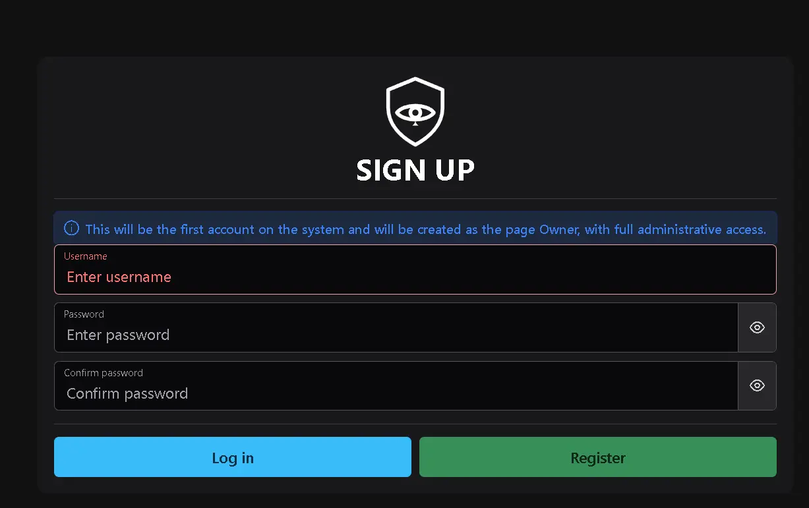
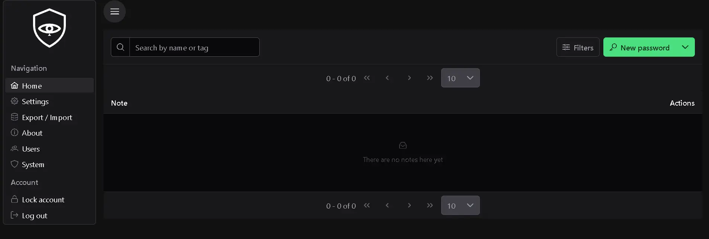

# Argyon

**Repository:** [github.com/juan327/argyon](https://github.com/juan327/argyon)

Argyon is an end-to-end encrypted notes app (**zero-knowledge**): all note content is encrypted and decrypted on the client, and the server only ever stores and transports ciphertext. The user's master password and the vault's encryption key (Vault Key) never leave the browser.

This project started as a personal tool built for my own use. I later decided to open-source it to share it with others, hoping it can be useful to someone else — whether for personal use or as a learning resource.

> [!WARNING]
> ### ⚠️ Personal use, not commercial — no third-party audit
>
> - **This project is intended primarily for personal use, not for commercial use.**
> - It is developed and maintained by **a single person** (obviously not counting the open-source third-party libraries the project depends on, listed below).
> - It has **not been audited by any third party**. As a result, it is **subject to vulnerabilities and errors**, known or unknown.
> - Use it at your own risk, evaluate it carefully before relying on it for sensitive data, and do not assume any warranty or guaranteed level of security. 🚫🔒

The project is made up of two parts:

- **`Argyon.Backend/`** — .NET 10 API (ASP.NET Core Web API) that exposes authentication, note/folder management, attachments, 2FA (TOTP) and settings, and also serves the frontend's static files.
- **`Argyon.Frontend/`** — Angular 21 SPA (standalone components, signals, PrimeNG + Tailwind) that implements all the encryption/decryption logic and consumes the API.

## Project goal

Provide a private notebook where not even the server itself can read the stored content. This is achieved with a key hierarchy derived entirely on the client:

1. **Vault Key (DEK)** — a random AES-256-GCM key that encrypts the actual content of notes. It is never sent in the clear to the server nor derived from the password.
2. **KEK (Key-Encryption-Key)** — derived from the master password via Argon2id (in the browser, with `argon2-browser`). Only used to wrap/unwrap the Vault Key; it never leaves the client.
3. The server only stores: the Argon2id password hash, the salt and KDF params used for the KEK, and the wrapped Vault Key (encrypted with AES-GCM) along with its IV. With that information the client can re-derive the KEK and unwrap the Vault Key locally on every login.
4. Each sensitive field of a note (name, description, tags, content) is encrypted independently with its own randomly generated IV, never reused across fields.
5. Changing the master password only re-wraps the existing Vault Key with a new KEK; the encrypted content of notes is never re-encrypted.

Main features:

- Note and folder management (hierarchy via `parentId`).
- Encrypted attachments.
- Authentication with an `HttpOnly`/`Secure`/`SameSite=Strict` cookie session (JWT), revocable from the server.
- Two-factor authentication (TOTP) with recovery codes.
- Multi-language support (English/Spanish) and light/dark themes.

## Screenshots

| Registration | Home |
|---|---|
|  |  |

## Prerequisites

- [.NET SDK 10](https://dotnet.microsoft.com/download)
- [Node.js](https://nodejs.org/) (a version compatible with Angular 21) and [pnpm](https://pnpm.io/) (the frontend uses `pnpm@11.15.0` as its `packageManager`)

## Building and running in development

### Backend (`Argyon.Backend`)

```bash
dotnet build Argyon.Backend/Argyon.Backend.csproj
dotnet run --project Argyon.Backend
```

- You can also use VS Code's "API" launch config, which sets `ASPNETCORE_ENVIRONMENT=Development`.
- The API uses SQLite by default; the database is created automatically at `Argyon.Backend/Data/Database/database.db` the first time it runs (no manual migration step needed to get started).
- The database provider, CORS, JWT, TOTP, attachment upload limits, and rate limiting are configured in `Argyon.Backend/appsettings.json` (and `appsettings.Development.json` for development).

### Frontend (`Argyon.Frontend`)

Run pnpm commands with `--dir Argyon.Frontend` (or `cd` into that directory first):

```bash
pnpm install --dir Argyon.Frontend
pnpm --dir Argyon.Frontend start
```

- The dev server is available at `http://localhost:4200/`.
- The API's default CORS origin is `http://localhost:4200` (configurable via `Cors:AllowedOrigins` in `appsettings.json`).

### Tests

```bash
pnpm --dir Argyon.Frontend test
```

Unit tests run on Vitest via the Angular CLI's `@angular/build:unit-test` builder (not Karma/Jasmine).

## Publishing (production build)

The frontend and backend are deployed together: the SPA compiles directly into `Argyon.Backend/wwwroot` (see `outputPath` in `Argyon.Frontend/angular.json`), and the backend serves that content as static files (`UseDefaultFiles` / `UseStaticFiles` in `Program.cs`). Because of this, the frontend must be built **before** publishing the backend.

### 1. Build the frontend

```bash
pnpm --dir Argyon.Frontend run build
```

This generates the production build and places it directly in `Argyon.Backend/wwwroot/` (not in `Argyon.Frontend/dist/`).

### 2. Publish the backend

```bash
dotnet publish Argyon.Backend/Argyon.Backend.csproj -c Release
```

`wwwroot` (with the SPA already built) is automatically included in the publish output, along with the API executable.

There are also publish profiles (`Argyon.Backend/Properties/PublishProfiles/`) ready to generate self-contained/runtime-specific builds from Visual Studio or `dotnet publish -p:PublishProfile=<profile>`:

- `win-x64.pubxml`
- `linux-x64.pubxml`
- `linux-arm64.pubxml`

Before deploying to production, review `Argyon.Backend/appsettings.json`: at minimum you must replace the `Jwt` and `Totp` secrets with your own values, configure `Cors:AllowedOrigins` with the frontend's real domain, and adjust `Database` if you're going to use PostgreSQL instead of SQLite (`Npgsql.EntityFrameworkCore.PostgreSQL` is already referenced for that case). If the API is deployed behind a reverse proxy, also review the `ForwardedHeaders` section.

## 🐳 Docker

You can also build and run Argyon (backend + frontend in a single container) with Docker, alongside a PostgreSQL database. All the files and the full guide are in [`Docker/Postgresql/`](Docker/Postgresql/README.md).

## ⚙️ Configuration (`appsettings.json`)

All API settings are read from ASP.NET Core's standard `IConfiguration`, so any field can be overridden with an equivalent environment variable using `__` (double underscore) as the level separator — for example `Jwt__Password` overrides `Jwt:Password`, or `Database__Postgresql__Password` overrides `Database:Postgresql:Password`.

> [!TIP]
> In production (Docker, systemd, cloud hosting, etc.) this lets you keep `appsettings.json` in version control with example/development values, and inject the real secrets only in the runtime environment. 🚀

### 🔐 Secrets and credentials (use environment variables)

> [!WARNING]
> These fields are cryptographic secrets or connection credentials. The values in the repository's `appsettings.json` are **for local development example purposes only** and must **never** be reused in production. Always inject them via environment variables (or a secrets manager) and keep them out of version control. 🚫📦

| 🔑 Section / field | 📝 Description | ⚠️ Criticality |
|---|---|---|
| `Database:Postgresql:Host` | PostgreSQL server host (only applies if `Database:Provider` is not `Sqlite`). | 🟠 Credential |
| `Database:Postgresql:Username` | PostgreSQL connection user. | 🟠 Credential |
| `Database:Postgresql:Password` | PostgreSQL connection password. | 🔴 Critical |
| `Database:Postgresql:Database` | Name of the PostgreSQL database to use. | 🟠 Credential |
| `Jwt:Password` | Secret used to derive the signing key for session JWTs. | 🔴 Critical — must be changed |
| `Jwt:Salt` | Salt used together with `Jwt:Password` to derive the signing key. | 🔴 Critical — must be changed |
| `Totp:EncryptionPassword` | Secret used to encrypt each user's TOTP secret in the database (`UserTotps`). | 🔴 Critical — must be changed |
| `Totp:EncryptionSalt` | Salt used together with `Totp:EncryptionPassword` for that encryption key. | 🔴 Critical — must be changed |

### 🧩 Remaining settings

Functional configuration fields — **not secrets**; using an environment variable here is optional and only useful if the parameter needs to vary between deployment environments.

| ⚙️ Section / field | 📝 Description | 🌱 Environment variable? |
|---|---|---|
| `Kestrel:Endpoints:Http:Url` | URL and port Kestrel listens on (e.g. `http://localhost:5000`). | 🟡 Recommended if the port varies between environments |
| `Database:Provider` | Active database provider: `Sqlite` (default, local file) or any other value to use PostgreSQL. | ⚪ No, fixed per deployment |
| `Database:Postgresql:Port` | PostgreSQL server port. | ⚪ Optional, usually fixed (5432) |
| `Cors:AllowedOrigins` | List of origins allowed by CORS (the domain the frontend is served from). | 🟡 Recommended in production |
| `ForwardedHeaders:Enabled` | Enables processing of `X-Forwarded-*` headers (needed if the API runs behind a reverse proxy/load balancer). | ⚪ Optional, depends on infrastructure |
| `ForwardedHeaders:TrustAnyProxy` | If `true`, trusts `X-Forwarded-*` headers from any origin (insecure except in very controlled cases). | ⛔ Don't enable via environment without manual review |
| `ForwardedHeaders:KnownProxies` | List of trusted proxy IPs whose `X-Forwarded-*` headers are accepted. | 🟡 Yes, if the proxy IP changes per environment |
| `ForwardedHeaders:KnownNetworks` | List of trusted proxy CIDR ranges (equivalent to `KnownProxies` but per network). | 🟡 Yes, if the proxy network changes per environment |
| `ForwardedHeaders:ForwardLimit` | Maximum number of proxy hops to process in the `X-Forwarded-For` chain. | ⚪ No, fixed based on network topology |
| `Jwt:Issuer` | `iss` (issuer) claim included in issued JWTs. | ⚪ No, identifying value |
| `Jwt:Audience` | `aud` (audience) claim validated on received JWTs. | ⚪ No, identifying value |
| `Jwt:AccessTokenExpiryMinutes` | Minutes the access token (session cookie) is valid before expiring. | ⚪ No, business parameter |
| `Jwt:RefreshTokenExpiryDays` | Days the session/refresh token remains valid on the server (`UserSessions`). | ⚪ No, business parameter |
| `VaultFreshness:RequireReverifyMinutes` | Minutes after which sensitive operations (marked with `RequireFreshVaultAttribute`) require re-verifying the password/vault. | ⚪ No, business parameter |
| `Attachments:MaxUploadSizeMb` | Maximum size (in MB) allowed for uploaded attachments; applies to both Kestrel's limit and MVC's multipart read limit. | 🟡 Useful if the limit varies by environment |
| `RateLimiting:Public:Enabled` / `Authenticated:Enabled` | Enables rate limiting for public / authenticated endpoints respectively. | ⚪ No, usually fixed |
| `RateLimiting:Public:PermitLimit` / `Authenticated:PermitLimit` | Maximum number of requests allowed per time window (public vs. authenticated). | 🟡 Optional, depends on environment (dev vs. prod) |
| `RateLimiting:Public:WindowSeconds` / `Authenticated:WindowSeconds` | Duration in seconds of the rate limiting counting window. | 🟡 Optional, same as above |
| `RateLimiting:Public:QueueLimit` / `Authenticated:QueueLimit` | Number of requests queued (instead of rejected immediately) once the limit is exceeded. | ⚪ No, usually fixed |

## Credits and libraries used

### Backend (.NET)

| Package | Use in the project | License |
|---|---|---|
| [Konscious.Security.Cryptography.Argon2](https://github.com/kmaragon/Konscious.Security.Cryptography) | Server-side Argon2id password hashing | MIT |
| [Microsoft.AspNetCore.Authentication.JwtBearer](https://github.com/dotnet/aspnetcore) | JWT-based authentication (session cookie) | MIT |
| [Microsoft.EntityFrameworkCore.Sqlite](https://github.com/dotnet/efcore) | Persistence with SQLite | MIT |
| [Npgsql.EntityFrameworkCore.PostgreSQL](https://github.com/npgsql/efcore.pg) | Alternative EF Core provider for PostgreSQL | PostgreSQL License |
| [Otp.NET](https://github.com/kspearrin/Otp.NET) | Generation/validation of TOTP codes for 2FA | MIT |

### Frontend (Angular)

| Package | Use in the project | License |
|---|---|---|
| [Angular](https://angular.dev/) (`@angular/*`) | SPA framework | MIT |
| [PrimeNG](https://primeng.org/) + [`@primeuix/themes`](https://github.com/primefaces/primeuix) | UI component library (Aura preset) | MIT |
| [PrimeIcons](https://github.com/primefaces/primeicons) | Iconography | MIT |
| [Tailwind CSS](https://tailwindcss.com/) | Styling utilities | MIT |
| [@ngx-translate/core](https://github.com/ngx-translate/core) + [@ngx-translate/http-loader](https://github.com/ngx-translate/http-loader) | Internationalization (English/Spanish) | MIT |
| [argon2-browser](https://github.com/antelle/argon2-browser) | Client-side KEK derivation (Argon2id) | MIT |
| [qrcode](https://github.com/soldair/node-qrcode) | QR code generation for 2FA enrollment | MIT |
| [RxJS](https://rxjs.dev/) | Reactive utilities | Apache-2.0 |
| [temporal-polyfill](https://github.com/fullcalendar/temporal-polyfill) | Polyfill for the `Temporal` API | MIT |

*Note: symmetric content encryption (AES-256-GCM) and client-side Argon2id hashing rely on the native `Web Crypto` APIs and `argon2-browser`; no additional cryptography library is included separately.*

## Additional resources

- Local PrimeNG documentation used by the project: [`docs/frontend/primeng/`](docs/frontend/primeng/).
- Angular CLI: [Angular CLI Overview and Command Reference](https://angular.dev/tools/cli).
</content>
